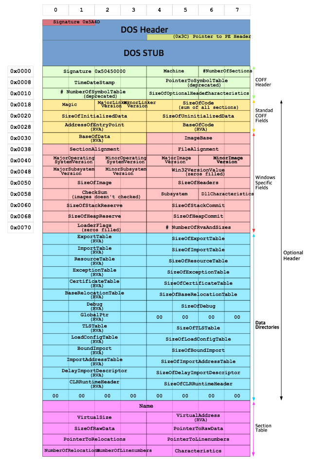

# PE(Potalbe Executable)란?
- Windows 운영 체제에서 사용되는 실행 파일(exe), DLL(Dynamic Link Library), Object 코드, SYS 드라이버와 같은 파일을 위한 포맷이다. 

- 실행 파일의 정보를 담고 있는 `PE Header`와 프로그램이 실행되었을 때 메모리로 옴겨져야할 코드들과 데이터들을 담고 있는 섹션 `PE Body`로 이루어져 있다.



## PE Header
- PE 파일의 다양한 속성과 필수 정보를 담고 있다.

- IMAGEDOS_HEADER, IMAGE_NT_HEADER, IMAGE_SECTION_HEADERS가 포함되어 있다.

# DOS_HEADER
- 말그대로 Windows DOS 시스템을 위한 헤더이다.

```C++
typedef struct _IMAGE_DOS_HEADER {
	WORD e_magic;
	WORD e_cblp;
	WORD e_cp;
	WORD e_crlc;
	WORD e_cparhdr;
	WORD e_minalloc;
	WORD e_maxalloc;
	WORD e_ss;
	WORD e_sp;
	WORD e_csum;
	WORD e_ip;
	WORD e_cs;
	WORD e_lfarlc;
	WORD e_ovno;
	WORD e_res[4];
	WORD e_oemid;
	WORD e_oeminfo;
	WORD e_res2[10];
	LONG e_lfanew;
} IMAGE_DOS_HEADER,*PIMAGE_DOS_HEADER;
```

1. e_magic
- PE 파일의 시작을 알리는 시그니쳐이다. 2바티으로 구성되어 있으며, PE 파일을 열어보면 `MZ`라는 데이터를 확인할 수 있다.

2. e_lfanew
- PE 파일 안의 IMAGE_NT_HEADER의 절대 위치(offset)을 가리키는 데이터로, 4바이트로 little endian으로 저장되어 있다.


## DOS STUB
- PE 파일의 각각 헤더 데이터는 구조체로 선언되어 있어, 그 크기가 변하지 않지만,DOS_STUB부분만 예외이다.

- DOS_HEADER과 NT_HEADER 사이에 존재하며, 시스템에서 실행 가능한 16비트 명령어를 넣을 수 있는 공간을 만들어 두었고, 이 코드가 바로 DOS Stub`이다.

- 명령어의 최대 크기를 제한하지 않기 위해 e_lfanew 구조체에 원하는 NT헤더가 존재하는 파일에서의 위치를 입력합으로써, Dos Stub코드를 길이 제한 없이 입력할 수 있다.

